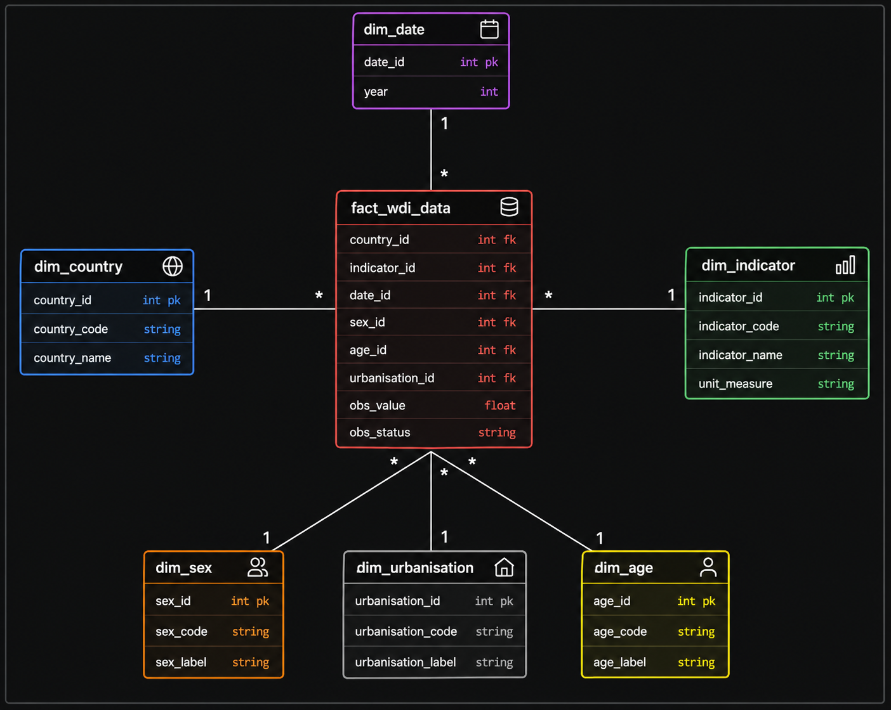

# Design Rationale

> Status: stub. Fill in as the build progresses — this should read like a defense of every schema decision, not just a restatement of the schema.

## TODO

- [x] Star schema diagram (link from `docs/diagrams/star-schema.png`)
- [ ] Why 6 dimensions, not fewer — restate the cardinality check reasoning from `DATA_DICTIONARY.md` in design terms
- [ ] Fact table grain: one row = one (country, indicator, year, sex, age, urbanisation) combination. Document the consequence: a "simple" lookup like *India's GDP per capita in 2020* returns multiple rows unless filtered to `sex = '_T' AND age = '_T' AND urbanisation = '_T'`
- [ ] `dim_age` parsing strategy — how `Y15T24`-style codes get decoded into readable labels
- [ ] Indexing decisions on the fact table (which FKs get indexed, why)
- [ ] Any normalization tradeoffs made for query performance


---

> **Status:** Work in Progress
> This document captures the reasoning behind schema design decisions as the warehouse evolves.

---

## Star Schema

The warehouse follows a **Star Schema** design consisting of a central fact table surrounded by descriptive dimension tables.

### Schema Diagram



---

### Current Dimensions

| Dimension          | Purpose                                              |
| ------------------ | ---------------------------------------------------- |
| `dim_country`      | Stores country codes and country names               |
| `dim_indicator`    | Stores indicator metadata and measurement units      |
| `dim_date`         | Stores the reporting year                            |
| `dim_sex`          | Stores sex categories (e.g., Male, Female, Total)    |
| `dim_age`          | Stores age-band classifications                      |
| `dim_urbanisation` | Stores urbanisation categories (Urban, Rural, Total) |

---

### Fact Table

The central fact table, **`fact_wdi_data`**, stores observed indicator values and references each dimension through foreign keys.

This design separates:

* **Descriptive attributes** → Dimension Tables
* **Measured values** → Fact Table

which enables efficient analytical queries and aligns with common data warehousing practices.

---

### Current Schema Overview

```text
dim_country      ─┐
dim_indicator    ─┤
dim_date         ─┤
dim_sex          ─┼──► fact_wdi_data
dim_age          ─┤
dim_urbanisation ─┘
```

---

> Additional design rationale will be documented as the ETL pipeline and warehouse implementation progress.
